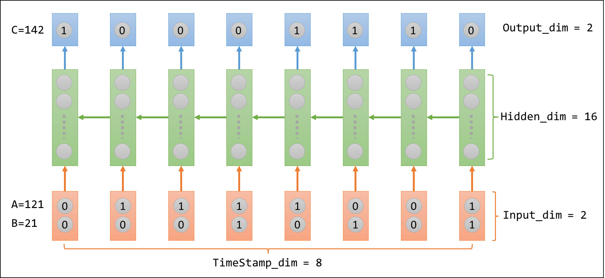
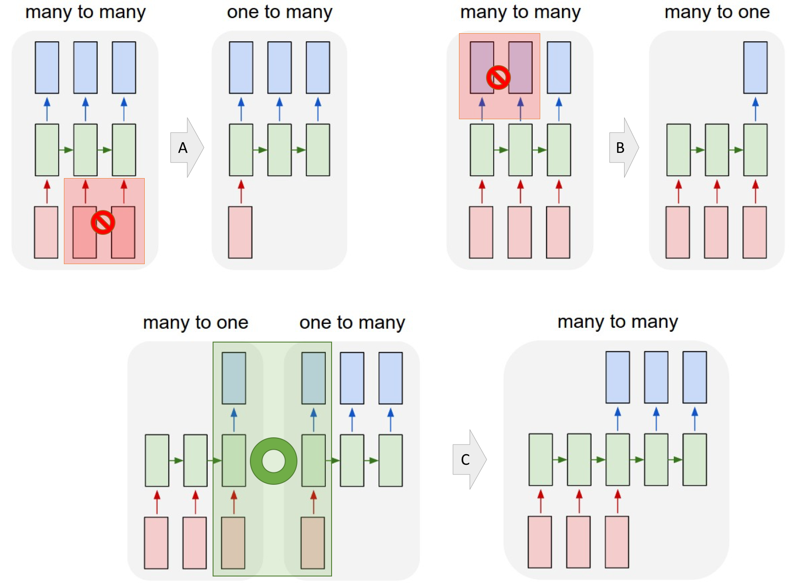

<!--# Project info-->

# PROJECT INFO

Project title: Deep learning with MXNet

Project short title (30 characters): Implement high-level interfaces (APIs) of Recurrent Neural Network (RNN) of MXNet to achieve user-friendly network construction.

URL of project idea page: <https://github.com/rstats-gsoc/gsoc2016/wiki/Deep-learning-with-mxnet>

<!--# Bio of Student -->

# BIO OF STUDENT

<!--Provide a brief (text) biography, and why you think your background qualifies you for this project.-->

- Yun is a graduate student majoring in Computer Science at New York University with emphasis on data science. It is not surprising that he is not only familiar with regular conventions (e.g. Git) and programming languages (e.g. C++) of software development, but also has solid knowledge of theories related to neural network and other machine learning applications. As a proof-of-concept to implement high-level API of LSTM which is [one of MXNet's github issues](https://github.com/dmlc/mxnet/issues/1420), he had already built a many-to-many [RNN model](https://gist.github.com/Puriney/072a37ea8a181f0b6168) from scratch which managed to learn 8-bit binary addition calculation. Model was implemented in Rcpp which fits the language requirement of this project. Therefore the CS background supports Yun to read the source code of MXNet, communicate with mentors, identify important but absent features, and ultimately finish implementation.
- Yun is an experienced R user who has been participating in developing R package. For example, [ChIPseeker](https://bioconductor.org/packages/release/bioc/html/ChIPseeker.html), a Bioconductor package for bioinformatics analysis; [honfleuR](https://github.com/Puriney/honfleuR), an extension supporting object-oriented programming in R S4 methods for an existed R package to analyze single-cell sequencing data. Therefore his strong interest and 4-year experience in R language make him a self-motivated and competent participant to help make a powerful deep learning package dedicated to R language community.
- Yun has rich research experience in computational biology with a Master degree in Molecular Biology. He realized deep learning is becoming a promising strategy to analyze large scale of data produced by biomedical studies. Therefore Yun has solid expert-domain knowledge and strong interest to apply deep learning to computational biology field by writing application examples for MXNet package. Therefore Yun's participation can bring to new impacts -- deep learning has a soft-landing on life sciences researches thanks to  MXNet's R package and likewise MXNet becomes more appealing to bioinformaticians and broaden user spectrum.

# CONTACT INFORMATION 

Student name: Yun Yan

Melange Link_id:  **fix-me!!!**

Student postal address: 334 E 25 St, Apt 213, New York, NY, 10010

Telephone(s): 917-756-3868

Email(s): yy1533@nyu.edu

## Student affiliation

Institution: New York University

Program: Computer Science, Tandon School of Engineering

Stage of completion: 2015.09 - 2017.06

Contact to verify: Office of Global Services (OGS), 5 MetroTech Center, Room 259, Brooklyn, NY 11201. Tel: (646) 997-3805


## Schedule Conflicts:

Off-keyboards on Sundays, otherwise there is no time schedule conflicts. I am dedicated to GSoC this summer.

# MENTORS

## Mentor names

Qiang Kou, Yuan Tang

Mentor link_ids: **Fix-me!!!**

<!--Have you been in touch with the mentors? When and how?-->

## Contact with Mentors

| Date      	| Event                                                                      	| Media        	|
|-----------	|----------------------------------------------------------------------------	|--------------	|
| 17-Feb-16 	| MXNet initiated idea page on rstats-GSoC                                   	| NA           	|
| 24-Feb-16 	| Finished a proof-of-concept of RNN implemented in Rcpp and contact mentors 	| Github       	|
| 2-Mar-16  	| Submitted "Pull Request" as qualification of mentor test                   	| Github       	|
| 2-Mar-16  	| Contact mentors to express my interest in MXNet's GSoC project             	| Email        	|
| 3-Mar-16  	| My PR being merged                                                         	| Github       	|
| 8-Mar-16 ~ 12-Mar-16  	| Drafts of student application form                                    	| Email&Github 	|

<!--# CODING PLAN & METHODS-->

<!--Describe in detail your plan for completing the work. What functions will be written, how and when will you do design, how will you verify the results of your coding? Describe perceived obstacles and challenges, and how you plan to overcome them.-->

<!--# Why this proposal-->

# WHY THIS PROPOSAL

**Enhancing R package of MXNet is going to provide R community a swift deep learning framework.** Supports for either advanced structure or accepted performance are not fulfilled by existed R package for deep learning, for example, nnet and deepnet. On the contrary, in Kaggle Data Science Competition, MXNet is getting popular among kagglers thanks to its ability (i.e. basic APIs of R package) to allow R users not only implement deep learning model without getting hands too wet in programming codes, but also train networks in affordable time via supporting GPU-accelerated. Therefore, the work proposed here is going to push MXNet a further step to better serve for R community.

**High-level APIs for advanced structures are absent.** Admittedly existed basic functions of MXNet's R package are so modularized, self-explaining, well-documented that could be used in combinations to design advanced networks, for example, LSTM (long-short term memory network) is built by MXNet's python APIs and shown in official [example](https://github.com/Puriney/mxnet/tree/master/example/rnn). However, what if MXNet supports high-level APIs for LSTM, GRU, bidirectional RNN and other types of RNN dedicatd to R community, R users could focus on data analysis and problem solving, rather than figuring out how to build advanced networks first. And [increasing needs](https://github.com/dmlc/mxnet/issues/837) for high-level APIs of RNN are reported.

<!--# Expected APIs and impacts-->

# EXPECTED APIs AND IMPACTS

I am planing to implement high-level functions for the following types of RNN (recurrent neural network) in light of its popularity in data science and absence in MXNet. There exists `mx.symbol.Convolution` for CNN already.

1. vanilla RNN
2. LSTM
2. GRU
2. bi-directional RNN
2. multi-layer RNN

The expected results should enable R users swiftly design a neural network. For example,  a model with vanilla RNN as hidden layer is expected to be constructed in following 3 steps rather than hundreds of R codes:

```r
data <- mx.symbol.Variable("data")
lay1 <- mx.symbol.vanillaRNN(data, num_hidden = 16)
vrnn <- mx.symbol.Softmax(lay1)
```

The expected impact is that R community could not only keep enjoying the MXNet's flexibility as it wisely incorporates symbolic configuration and imperative programming together, but also have an end-to-end deep learning framework without being distracted by thinking of coding details.

<!--# Coding Plans and methods-->

# CODING PLANS AND METHODS

The project requires student with programming skills on Rcpp and solid knowledge of deep learning.

As a proof of concept, I had already implemented RNN to learn 8-digit binary calculus using Rcpp starting from scratch (See [Gist](https://gist.github.com/Puriney/072a37ea8a181f0b6168)), e.g. learning $\,01111001 + 00010101 = 10001110\,$  for $\,121+21=142\,$. Because the each digit is equivalent to timestamp, shown as following figure, my proof-of-concept implementation was indeed equivalent to and did manage to fulfill a synced many-to-many RNN construction.



(The green arrows indicating the direction of forward propagation within hidden layer are reversed for better illustration of binary addition.)

## Four types of vanilla RNN


(Source: <http://karpathy.github.io/2015/05/21/rnn-effectiveness/>)

```r
mx.symbol.vanillaRNN(symbol, name, hidden_dim, type = c('1toN', 'Nto1', 'NtoN', 'syncNtoN'), ...)
```

My proof-of-concept is imperative programming while the network in built by symbolic configuration in MXNet. Therefore I plan to implement high-level API for synced many-to-many RNN at first.

Once imperative-to-declarative translation were finished, solutions for composing graph of the rest three categories of RNN are expected to be straightforward, in light of the fact that these three are derivations of synced many-to-many RNN, shown as following diagram.



(Operation A: suppress part of input; Operation B: suppress part of output; Operation C: combine/group the two layers highlighted in green rectangular. Figures are modified from [here](http://karpathy.github.io/2015/05/21/rnn-effectiveness/))


## LSTM

LSTM is specific type of RNN while it is independently listed given its popularity.


(Source: <http://colah.github.io/posts/2015-08-Understanding-LSTMs/>)

The developer of MXNet's Julia package once posted a step-by-step [tutorial](http://mxnetjl.readthedocs.org/en/latest/tutorial/char-lstm.html) for constructing LSTM. Therefore I am expected to follow the logics to implement symbol operation for LSTM.

## GRU

GRU is derivation of LSTM. It combines input gate and forget gate combined as update gate, and comes up with other minor modifications.


(Source: http://colah.github.io/posts/2015-08-Understanding-LSTMs/)

## Bidirectional RNN

Within this computation graph, forward propagation and backward propagation run through their own layer.

Ref: [Hybrid Speech Recognition with. Deep Bidirectional LSTM](http://www.cs.toronto.edu/~graves/asru_2013.pdf)

## Multi-layer RNN


(Source: <https://www.tensorflow.org/versions/r0.7/tutorials/seq2seq/index.html>)


# PERCEIVED OBSTACLES

The critical turn-overs are: 

1. How to precisely adapt my knowledge and existed imperative implementation (as the proof-of-concept mentioned before) to MXNet's high-level APIs, so that R users could enjoy symbolic configuration.
2. How to make APIs support performance as much as possible.

For first part, I could wrap up all basic interfaces to write functions with parameters to support user-defined network structures. If necessary, I would make modifications for *R/src/symbol.cc* , etc to meet development needs. Because basic interfaces contain parameters related to GPU, wrapper function could take care of performance.

For second part which is native implementation, fortunately MXNet team maintains a well-documented guide for new developers, in particular the following posts stated the rules and conventions I need to follow:

1. [How to Create New Operations (Layers)](http://mxnet.readthedocs.org/en/latest/tutorial/new_op_howto.html)
2. [Operators in MXNet](https://mxnet.readthedocs.org/en/latest/developer-guide/operator.html)

For example, the implementation of CNN layer is via three source files located at directory *src/operator/* : `convolution-inl.h`, `convolution.cc`, `convolution.cu`. In the similar way, I could implement the new operators for RNN.

Furthermore, MXNet's R package has already set up the fundamental interfaces thus my work will not start from scratch. 

Putting things together, I could have feasible approaches to implement high-level APIs for RNNs and handle perceived problems in affordable time.

# TIMELINE

<!--(consult GSOC schedule)-->

<!--Provide a detailed timeline of how you plan to spend your summer.  **Don't leave testing and documentation for last**, as that's almost a guarantee of a failed project. -->

<!--What is your contingency plan for things not going to schedule? -->

## Pre-coding period

| Start       	| End         	| Topic                                                                                                                                                                               	|
|-------------	|-------------	|-------------------------------------------------------------------------------------------------------------------------------------------------------------------------------------	|
| 25-Apr-2016 	| 1-May-2016  	| Read documents. Get familiar with **details** of code structure for neural network symbol.                                                                                              	|
| 2-May-2016  	| 8-May-2016  	| Read documents. Get familiar with **details** of code structure of tensor computation in mxnet so that I could better adapt my RNN codes for appropriate  forward/backward propagation. 	|
| 9-May-2016  	| 16-May-2016 	| NYU Final exam season.                                                                                                                                                                  	|
| 17-May-2016 	| 22-May-2016 	| Contact with mentors to get started. Set up formal communication tools e.g. Gitter.                                                                                                 	|


## Coding Period

The following 4 jobs must be done when working on every API.

1. Implementation of high-level API;
2. **Testing** (see details of codes tests as sections below);
3. **Write demos and case studies**;
4. Submit codes and discuss with mentors to see whether they are ready to be merged into main stream.


| Start       	| End         	| APIs             	| Demo                          	| Days 	|
|-------------	|-------------	|------------------	|-------------------------------	|------	|
| 23-May-2016 	| 5-Jun-2016  	| Synced Many2Many 	| Binary Addition               	| 14   	|
| 6-Jun-2016  	| 16-Jun-2016 	| One2Many         	| Image Classification          	| 11   	|
| 17-Jun-2016 	| 26-Jun-2016 	| Many2One         	| Char RNN                      	| 10   	|
| 27-Jun-2016 	| 5-Jul-2016  	| Many2Many        	| Translation English to French 	| 9    	|
| 6-Jul-2016  	| 14-Jul-2016 	| Bidirectional    	| Translation English to French 	| 9    	|
| 15-Jul-2016 	| 24-Jul-2016 	| Stacked          	| Translation English to French 	| 10   	|
| 25-Jul-2016 	| 7-Aug-2016  	| LSTM             	| Char RNN                      	| 14   	|
| 8-Aug-2016  	| 21-Aug-2016 	| GRU              	| Char RNN                      	| 14   	|


If there are extra free time, I would like to reproduce the CNN model published on Nature magazine in order to draw attention of R users in bioinformatics, computational biology field.


(Source: <http://www.nature.com/nbt/journal/v33/n8/full/nbt.3300.html>)

## Post-coding period

22-Aug-2016: Wrapping up the entire project. Because project is finishing API one-by-one, documents and tests are expected to qualified and final wrapping up will not take too long.

From 23-Aug-2016 to 29-Aug-2016: Final Evaluation.

# MANAGEMENT OF CODING PROJECT

<!--How do you propose to ensure code is submitted / tested?-->

<!--How often do you plan to commit?  What changes in commit behavior would indicate a problem?-->

## Where are codes deployed

Fork of MXNet's repository: <https://github.com/Puriney/mxnet>. 

## How to test codes

### Travis Test
My codes can directly use the Travis tests currently used by MXNet's main repository. Once passing, they are always ready to be merged into main stream.

### Fast Test
As it is R package, I could use the following snippet to test the R package.

```r
R CMD check --no-examples --no-manual --no-vignettes --no-build-vignettes mxnet_*.tar.gz
```

In addition, thanks to roxygen2, possible conflicts will be reported when it generates documents for functions.

### Test against real data
Writing case studies and demos for functions are good conventions of MXNet and I am expected to follow. In MXNet repository, there existed data of Penn Treebank Project for RNN, thus I could run test by applying these data on my codes.

## Expected Commits Frequency

Commits will be pushed in every 2 days. Commits within a working period (6 days) are squashed as one commit to make history clean and friendly to be ready to be merged into MXNet's main repository. 

Being absent for 10 days suggests I must come across with problems.


# TEST

<!--Describe the qualification test that you have submitted to you project mentors.  If feasible, include code, details, output, and example of similar coding problems that you have solved.-->

I fixed an issue which afterwards merged (See: [here](https://github.com/dmlc/mxnet/pull/1554)) into MXNet main repository. It supports Xavier strategy to initialize weights, clipping gradient (i.e. fixing calculated gradient within a range), scheduling mini-changes for learning rate value along training process.

<!--# Anything Else-->